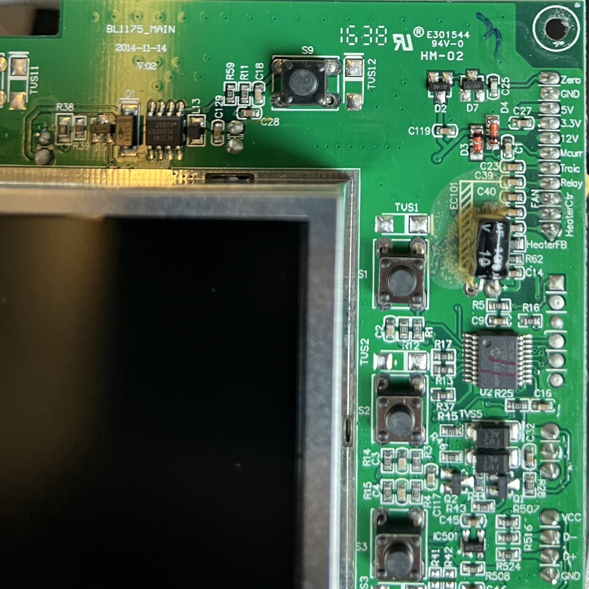
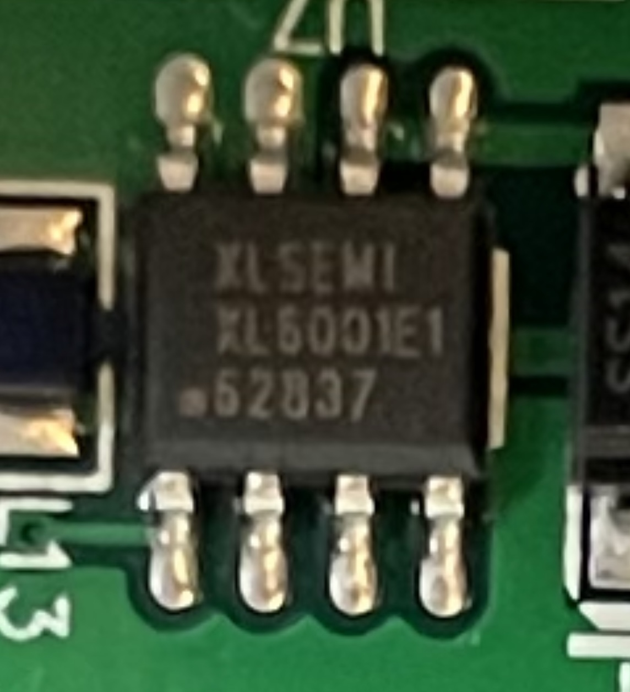
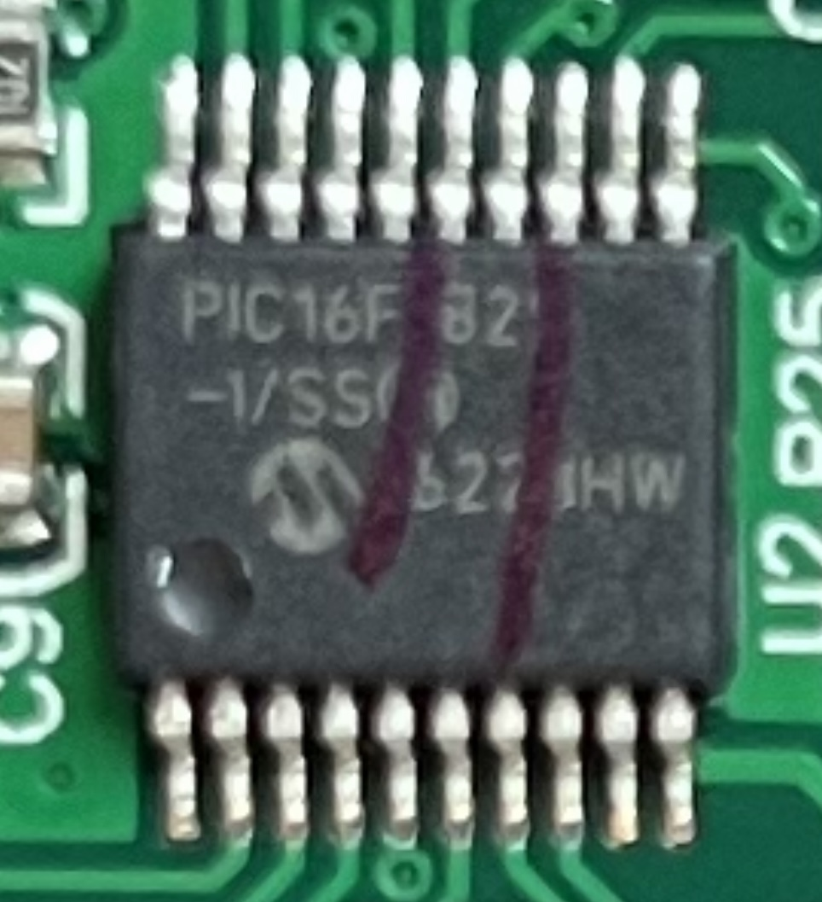
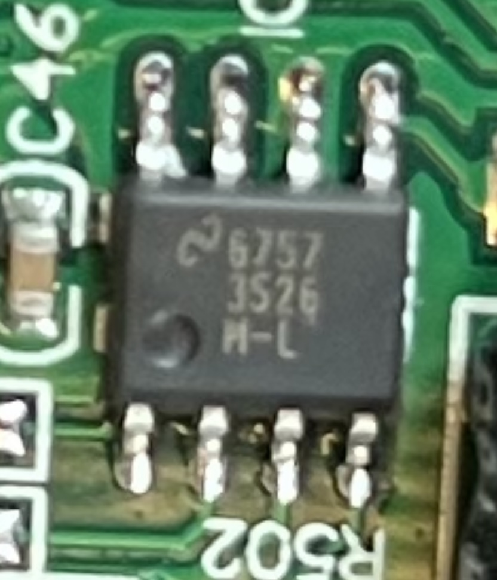

# Magimix Cook Expert 18900
## Strings on the control unit
* BL1175_MAIN
* 2014-11-14
* V:02
* 1638 
* E301544
* 94V-0
* HM-02
* IC500
* RU ( [Recognized Component Mark](https://en.wikipedia.org/wiki/UL_(safety_organization)) )
> The "Recognized Component Mark" is a type of quality mark issued by Underwriters Laboratories. It is placed on components which are intended to be part of a UL listed product, but which cannot bear the full UL logo themselves.[6] The general public does not ordinarily come across it, as it is borne on components which make up finished products.

## Strings on IC's

1. XLSEMI XL6001E1 62837 [( Identified as 400KHz 32V 2A Switching Current Boost LED Constant Current Driver )](datasheet/XLSEMI-XL6001E1.pdf) 

2. PIC16F82 -1/SS 327 HW ( Identified as a microchip PIC16F, still trying to find which one specific )
due marking, these are the options left which it can be
* PIC16F1826
* PIC16F1826T-I/SS
* [PIC16F1826-I/SS](datasheet/PIC16F1826.pdf)
* PIC16LF1826-I/SS (I don't think its the T, since that would show on the ic)
I'm fairly certain its this one

3. 6757 3S26 M-L ( does this say 3526 M-L? this could be a LM3526 Dual Port USB Power Switch and Over-Current Protection )

