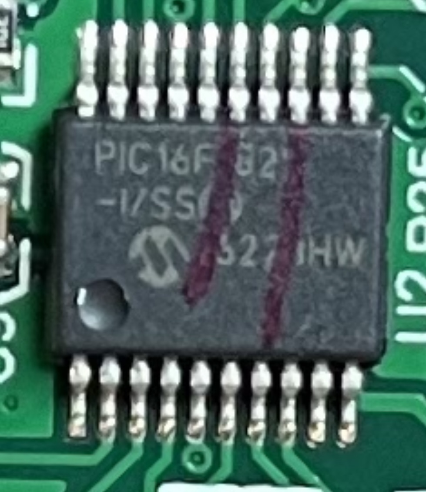

# Magimix Cook Expert 18900
## Strings on the control unit
* BL1175_MAIN
* 2014-11-14
* V:02
* 1638 
* E301544
* 94V-0
* HM-02
* IC500

## Strings on IC's

1. XLSEMI XL6001E1 62837 [( Identified as 400KHz 32V 2A Switching Current Boost LED Constant Current Driver )](datasheet/XLSEMI-XL6001E1.pdf) 

2. PIC16F82 -1/SS 327 HW ( does it say 	PIC16F82  ? )

3. 6757 3S26 M-L

